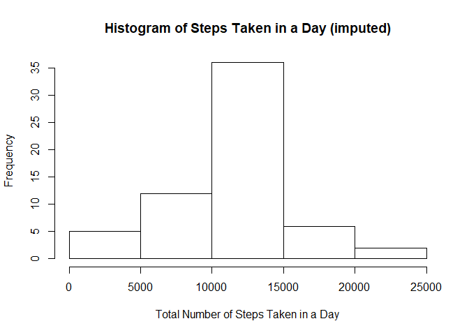

## Introduction

The purpose of this document is to satisfy the requirements of the project 1
peer-graded assignment that is part of the Reproducible Research course within
the Data Science Specialization on Coursera. As per the instructions the
document must read and manipulate the data to produce a number of plots. A
portion of the project explores imputing missing values.

The `dplyr` and `lattice` packages are required to execute this code. The input
for this document is the data set which can be obtained from [here][1]. The code
will download and extract the data file into the current working directory. The
output is this report which is generated from a markdown file using knitr.

[1]: https://d396qusza40orc.cloudfront.net/repdata%2Fdata%2Factivity.zip  "here"


## Loading and preprocessing the data

The instructions say:

>Show any code that is needed to
>
1. Load the data (i.e. `read.csv()`)
2. Process/transform the data (if necessary) into a format suitable for your
analysis


```r
library(dplyr)
library(lattice)

# Check if the file exists in the current directory before downloading it again
file.name <- "ProjectData.zip"

if (!file.exists(file.name)) {
  url <- "https://d396qusza40orc.cloudfront.net/repdata%2Fdata%2Factivity.zip"
  download.file(url, file.name)
  rm(url)
}

# Check if the files have been unzipped before unzipping again
if (!file.exists("activity.csv")) {
  unzip(file.name)
}
rm(file.name)

# Read in data
data <- read.csv("activity.csv", colClasses = c("integer", "Date", "integer"))
# 17568 obs of 3 variables
```

The data frame called `data` will be manipulated in each of the subsections
below into a series of tables which help to understand the data and produce the
plots.


## What is mean total number of steps taken per day?

The instructions say:

>For this part of the assignment, you can ignore the missing values in the
dataset.
>
1. Make a histogram of the total number of steps taken each day
2. Calculate and report the mean and median total number of steps taken per day


```r
# Prepare a table to create the histogram from
table.1 <- as_tibble(data) %>%  # 17568 obs of 3 variables
             group_by(date) %>%
             summarize(total.steps = sum(steps)) %>%  # 61 obs of 2 variables
             filter(!is.na(total.steps))  # 53 obs of 2 variables

# Create a histogram of the total number of steps taken each day
hist(table.1$total.steps, main = "Histogram of Steps Taken in a Day",
     xlab = "Total Number of Steps Taken in a Day")
```

<!-- -->

```r
# Calculate the mean and median total number of steps taken per day
mean.1 <- round(mean(table.1$total.steps), digits = 1)  # 10766.2
median.1 <- median(table.1$total.steps)  # 10765L
```

The histogram is shown above. For the total number of steps taken per day, the
mean is 10766.2 and the median is 10765.


## What is the average daily activity pattern?

The instructions say:

>1. Make a time series plot (i.e. `type = "l"`) of the 5-minute interval
(x-axis) and the average number of steps taken, averaged across all days
(y-axis)
2. Which 5-minute interval, on average across all the days in the dataset,
contains the maximum number of steps?


```r
# Prepare a table to create the histogram from
table.2 <- as_tibble(data) %>%
             group_by(interval) %>%
             summarize(mean.steps = mean(steps, na.rm = TRUE))  # 288 obs of 2

# Create a time series plot of the 5-minute interval versus average steps
plot(table.2$interval, table.2$mean.steps, type = "l",
     main = "Average Number of Steps Taken by Interval",
     xlab = "5 Minute Interval", ylab = "Average Number of Steps")
```

<!-- -->

```r
# Determine which 5-minute interval on average has the most steps
table.2a <- table.2 %>%
              filter(mean.steps == max(mean.steps)) %>%  # 1 obs of 2 variables
              select(interval)  # 1 obs of 1 variable

max.interval.2 <- table.2a[[1]]  # 835L
rm(table.2a)
```

The line plot is shown above. On average across all days, the 5-minute interval
that contains the maximum number of steps is 835, which
represents 8:35 AM.


## Imputing missing values

The instructions say:

>Note that there are a number of days/intervals where there are missing values
(coded as `NA`). The presence of missing days may introduce bias into some
calculations or summaries of the data.
>
1. Calculate and report the total number of missing values in the dataset (i.e.
the total number of rows with `NA`s)
2. Devise a strategy for filling in all of the missing values in the dataset.
The strategy does not need to be sophisticated. For example, you could use the
mean/median for that day, or the mean for that 5-minute interval, etc.
3. Create a new dataset that is equal to the original dataset but with the
missing data filled in.
4. Make a histogram of the total number of steps taken each day and Calculate
and report the mean and median total number of steps taken per day. Do these
values differ from the estimates from the first part of the assignment? What is
the impact of imputing missing data on the estimates of the total daily number
of steps?


```r
# Calculate how many rows have missing values in the dataset
na.count.3 <- sum(is.na(data$steps))  # 2304L

# Devise a strategy for filling in the missing values
# Check if there is a pattern behind when the NA values occur
table.3 <- as_tibble(data) %>%
             group_by(date) %>%
             summarize(na.count = sum(is.na(steps))) %>%  # 61 obs of 2 vars
             arrange(desc(na.count)) %>%
             print()
```

```
## # A tibble: 61 x 2
##    date       na.count
##    <date>        <int>
##  1 2012-10-01      288
##  2 2012-10-08      288
##  3 2012-11-01      288
##  4 2012-11-04      288
##  5 2012-11-09      288
##  6 2012-11-10      288
##  7 2012-11-14      288
##  8 2012-11-30      288
##  9 2012-10-02        0
## 10 2012-10-03        0
## # ... with 51 more rows
```

The total number of missing values in the dataset is 2304. By looking
at the table created above one can see that all 2304 `NA` values are
accounted for in just 8 days where all 288 observations are missing. One
explanation is that the device was not functioning during these days. In this
case the missing values could be imputed by using the average steps per interval
across all days. A starting point for this "average day" was previously created
in `table.2`, but the values should be rounded so that all values for `steps`
are integers. These rounded values will be used to impute the missing data in
this exercise.


```r
# Fill in the missing data
# Modify table.2 to create an "average day"
table.2b <- table.2 %>%
              mutate(steps = round(mean.steps, digits = 0)) %>%  # 228 obs of 3
              mutate(steps = as.integer(steps)) %>%  # 228 obs of 3 variables
              select(-mean.steps)  # 228 obs of 2 variables

# Split and apply the strategy to the NA rows
table.3a <- as_tibble(data) %>%
              filter(is.na(steps)) %>%  # Get the NA rows, 2304 obs of 3 vars
              select(-steps) %>%  # 2304 obs of 2 variables
              inner_join(table.2b, by = "interval") %>%  # Fill in steps
              select(steps, date, interval)  # Reorder columns, 2304 obs of 3

# Split the non-NA rows also, but nothing needs to be applied to these rows
table.3b <- as_tibble(data) %>%
              filter(!is.na(steps))  # Get the non-NA rows, 15264 obs of 3 vars

# Combine the two tables
data.imputed <- bind_rows(table.3a, table.3b) %>%
                  arrange(date, interval)  # 17568 obs of 3 variables

# Prepare a table to create the histogram from
table.3c <- data.imputed %>%
              group_by(date) %>%
              summarize(total.steps = sum(steps))  # 61 obs of 2 variables

# Create histogram of the total number of steps taken each day
hist(table.3c$total.steps, main = "Histogram of Steps Taken in a Day (imputed)",
     xlab = "Total Number of Steps Taken in a Day")
```

<!-- -->

```r
# Calculate the mean and median total number of steps taken per day
mean.3 <- round(mean(table.3c$total.steps), digits = 1)  # 10765.6
median.3 <- median(table.3c$total.steps)  # 10762L
```

The `data.imputed` dataset was created, and it is equal to the original dataset
with the missing data filled in. The histogram showing the total number of steps
taken per day for the imputed data is shown above. The mean is
10765.6 and the median is 10762. These
values are slightly different from those calculated in part 1, but this is due
to how the number of steps were rounded to integer values in `table.2b`. The
main impact of imputing the missing data is on the probability distribution of
the values for steps (it makes values near the mean appear more probable).


## Are there differences in activity patterns between weekdays and weekends?

The instructions say:

>For this part the `weekdays()` function may be of some help here. Use the
dataset with the filled-in missing values for this part.
>
1. Create a new factor variable in the dataset with two levels -- "weekday" and
"weekend" indicating whether a given date is a weekday or weekend day.
2. Make a panel plot containing a time series plot (i.e. `type = "l"`) of the
5-minute interval (x-axis) and the average number of steps taken, averaged
across all weekday days or weekend days (y-axis).


```r
# Create a new factor variable for the type of day (weekday or weekend)
table.4 <- as_tibble(data.imputed) %>%  # 17568 obs of 3 variables
             mutate(weekday = weekdays(date)) %>%  # 17568 obs of 4 variables
             mutate(weekend.test = weekday %in% c("Saturday", "Sunday")) %>%
             mutate(day.type = factor(weekend.test,
                                      labels = c("weekday", "weekend"))) %>%
             select(-(weekday:weekend.test)) %>%  # 17568 obs of 4 variables
             group_by(interval, day.type) %>%
             summarize(mean.steps = mean(steps))  # 576 obs of 3 variables

# Make a panel plot containing a time series plot of the interval
print(xyplot(mean.steps ~ interval | day.type, data = table.4, type = "l",
             main = "Average Number of Steps Taken by Interval and Day Type",
             xlab = "5 Minute Interval", ylab = "Average Number of Steps",
             layout = c(1, 2)))
```

<!-- -->

The factor variable for the type of day was added to the imputed data in
`table.4` which was later summarized by interval and day type to create the
panel plot above.

